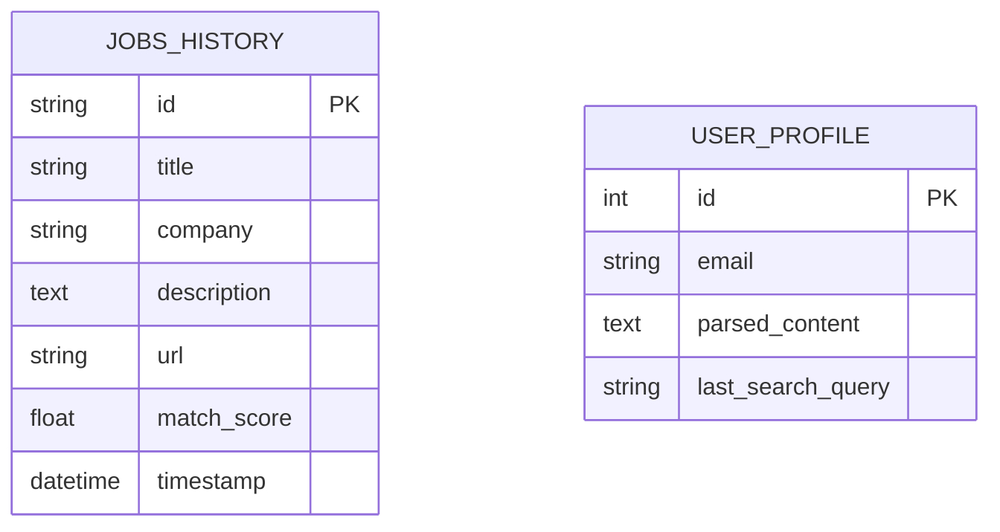

# AI Smart Job Recommendation and Notification System

## 1. Abstract
The **AI Smart Job Recommendation and Notification System** is a privacy-first, edge-AI platform designed to revolutionize the job search process. By replacing traditional keyword-based Applicant Tracking Systems (ATS) with semantic vector search (RAG) and local Large Language Models (LLMs), the system provides deep insights into a candidate's profile and matches them with high-quality, real-time job postings. It aggregates data from multiple sources (Adzuna, SerpAPI), detects fraudulent listings via a dedicated Safety Agent, and automates matching notifications through a background scheduler.

---

## 2. System Architecture

The architecture follows a modular paradigm, ensuring scalability and separation of concerns.

### 2.1 Use Case Diagram
Visualizing the interactions between the User, Local LLM, and External APIs.

```mermaid
usecaseDiagram
    actor "User (Job Seeker)" as User
    actor "Local LLM (Ollama)" as LLM
    actor "External APIs (Adzuna/SerpAPI)" as APIs
    actor "Email System (SMTP)" as SMTP

    package "AI Smart Job Assistant" {
        usecase "Upload & Parse Resume" as UC1
        usecase "Analyze Profile (ATS & Skills)" as UC2
        usecase "Search for Jobs" as UC3
        usecase "Semantic Matching (RAG)" as UC4
        usecase "Scam Detection (Safety Agent)" as UC5
        usecase "Subscribe to Daily Alerts" as UC6
        usecase "Receive Email Notifications" as UC7
        usecase "View Search History" as UC8
    }

    User --> UC1
    User --> UC3
    User --> UC6
    User --> UC8

    UC1 ..> UC2 : <<include>>
    UC2 --> LLM
    
    UC3 --> APIs
    UC3 ..> UC4 : <<include>>
    
    UC4 --> LLM
    UC4 ..> UC5 : <<include>>
    
    UC5 --> LLM
    
    UC6 ..> UC7 : <<include>>
    UC7 --> SMTP
    
    UC7 -- APIs : "Fetches new data"
```

### 2.2 System Modules

| Module | Responsibility | Technology |
| :--- | :--- | :--- |
| **Resume Parser** | Extracting text, calculating years of experience, detecting seniority. | PDFMiner, python-docx, Regex |
| **LLM Engine** | ATS Scoring, Resume Analysis, Skill Extraction. | Ollama (Llama3 / Gemma) |
| **Job Sourcing** | Real-time job fetching from global and regional portals. | Adzuna API, SerpAPI |
| **RAG Matcher** | Semantic vector search and context-aware job scoring. | FAISS, Sentence-Transformers |
| **Safety Agent** | Trust scoring and scam detection for job listings. | Heuristics, Local LLM |
| **Notification Engine**| Scheduled background matching and email delivery. | APScheduler, SMTP |

---

## 3. Core Modules Analysis

### 3.1 Universal Experience Parser (`src/parser.py`)
Unlike standard parsers that look for keywords, this module uses **10 distinct regex patterns** to identify temporal data (e.g., "Jan 2021 - Present", "Two years", "6 months"). It employs a hierarchical section detection logic to isolate the "Experience" block before calculation, ensuring accurate seniority labeling (Entry, Junior, Mid, Senior).

### 3.2 Semantic RAG Matching (`src/rag_matcher.py`)
1. **Vectorization**: Job descriptions are encoded into 384-dimensional vectors.
2. **Indexing**: FAISS creates a flat L2 index for extremely fast nearest-neighbor search.
3. **Reasoning**: The top-K candidates are then passed to the Local LLM, which provides a granular **Match Score (0-100)** and identifies specific "Skill Gaps".

### 3.3 Safety Agent (`src/safety_agent.py`)
To protect users from "Ghost Jobs" or scams, the Safety Agent performs:
- **Heuristic Check**: Identifying "Whatsapp-only" applications or payment requests.
- **LLM behavioral Check**: Analyzing the Job Description for unprofessional tone or suspicious requirements.

---

## 4. Database Schema

The system uses SQLite for efficient local state management.



---

## 5. Technology Stack
- **Frontend**: Streamlit
- **AI Core**: Ollama (Local LLM), Sentence-Transformers, FAISS
- **Data Layers**: SQLite, Pandas
- **Document Processing**: PDFMiner.six, python-docx
- **Scheduling**: APScheduler

---

## 6. Conclusion
The **AI Smart Job Assistant** represents a major shift toward high-precision, user-owned job searching. By running LLMs locally and utilizing RAG-based matching, it eliminates the inefficiencies of traditional boards while ensuring complete data privacy for the candidate.
